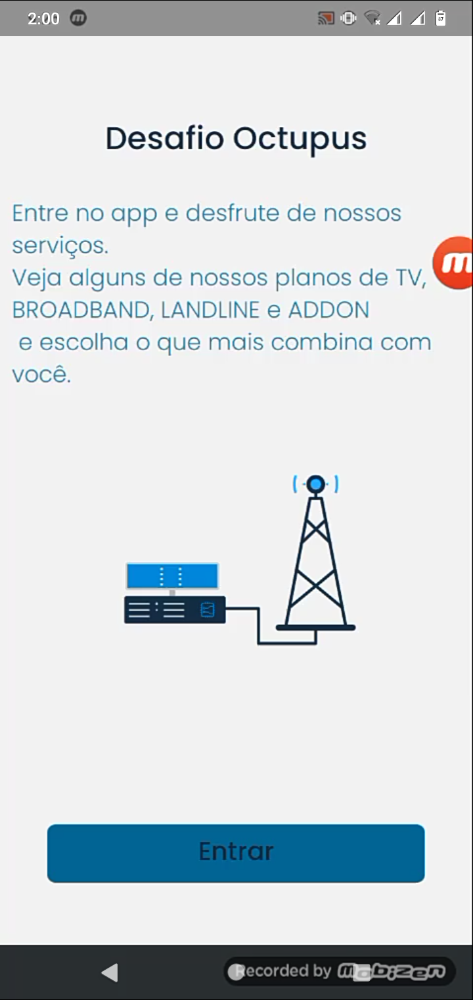
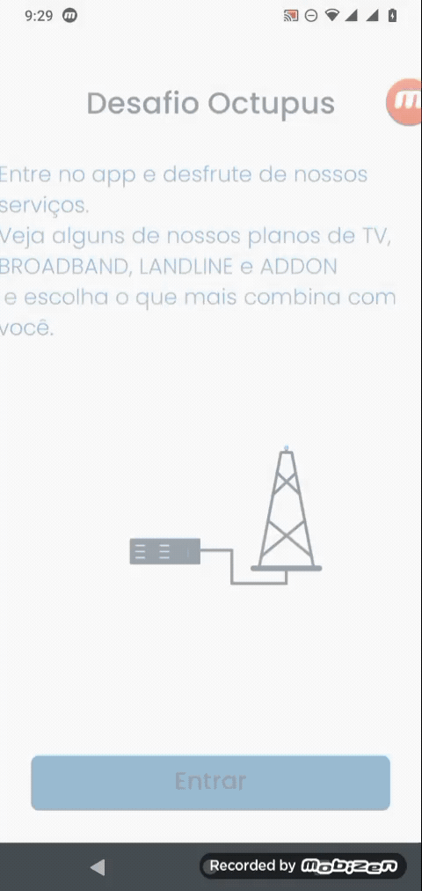

<h1 align="center">
Desafio Octupus</h1>
<h4 align="center" style="margin-bottom:30px">
Criação de app para teste pra Octupus
</h4>

<h1 align="center">
Objetivo</h1>

Desenvolver um aplicativo "fictício" de uma empresa de telecomunicações oferecendo ao cliente seus produtos.

<h1 align="center" >⚡ Tecnologias</h1>

<a href="https://docs.expo.io/">Expo</a>

<a href="https://docs.expo.io/guides/using-custom-fonts/">Expo Google fonts</a>

<a href="https://docs.expo.io/versions/latest/sdk/lottie/">Lottie</a>

<a href="https://www.typescriptlang.org/">Typescript</a>

<a href="https://eslint.org/">Eslint</a>

<a href="https://prettier.io/">Prettier</a>

<h1 align="center">
🚀 Projeto
</h1>

